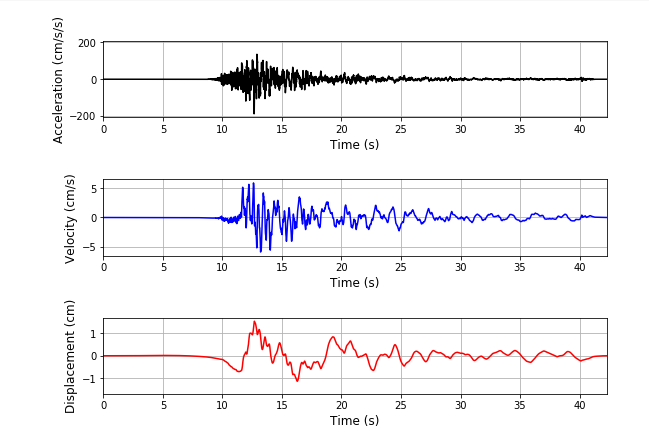

   

---

    

        

            
Department of Civil Engineering

            
EQE 582_ Introduction to SEISMOLOGY

            
Python applications for Seismology

            
        

    

This repository covers six weeks of **_"EQE582_Introduction to Seismology"_** lecture applications. It starts with introductory to Python and proceeds with the seismology tools for **Earhquake and Structure Engineering** program graduate students.

---
Attend to [Slack App](https://app.slack.com/client/T01FY4SLLSW/C01FV26R0J1);an informal platform for **Q/A** discussions about Python coding and more, with your collegues.

---
## Contact

Ahu Kömeç Mutlu :smiley: [@komec](https://twitter.com/ahukomecmutlu)

---
## Acknowledgements
* [Python documenation](http://docs.python.org/)
* Seismo-Live: http://seismo-live.org
* [IPython/Jupyter notebook](http://www.nature.com/news/interactive-notebooks-sharing-the-code-1.16261)

---
